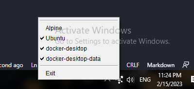

# Wsl Desktop 

  

## Mangment tool  for manage windows subsystem linux distribution 🧰

 

*<h3 style="color:rgb(110, 150, 255)">Provides ease of control of subsystem</h3>*

 

---------
 

## Key Feature
- show all subsystem 
- run distribution
- shutdown distribution

 

----------

----------
 

AhmdFahad 🦸🏻‍♂️

